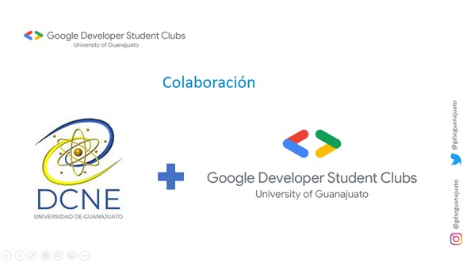
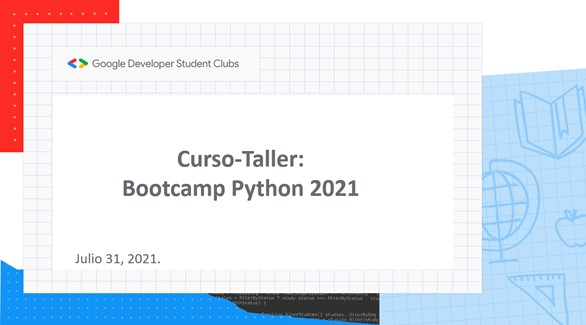
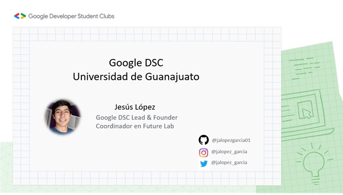
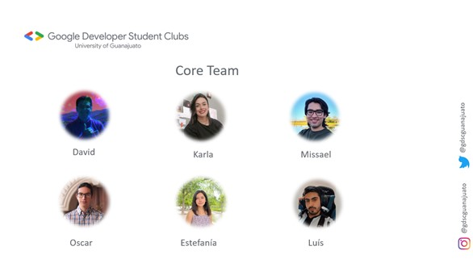
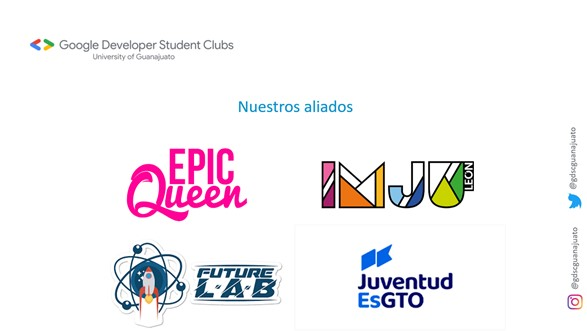

# Bootcamp Python 2021 

## _**Curso - Taller: Cómputo Científico con Python**_

Curso desarrollado por el **Google Developer Student Club** en colaboración con la Universidad de Guanajuato por parte del _**Departamento de Ingeniería Química**_ de la **División de Ciencias Naturales y Exactas** para la capacitación-actualización de un grupo de estudiantes y profesores de la Casa de Estudios. 

## Asistentes del Curso-Taller

| Participante(s)                         | Actividad Laboral/Academica                |
| -----------------------------------     |:------------------------------------------:|
| _Dr. Julián Cabrera Ruiz_               | Profesor-Investigador/ Facilitador         |
| _Jesús Armando López García_            | Instructor/Google DSC Lead                 |
| _Josué Julián Herrera Velázquez_        | Asistente                                  |
| _Victor Enrique Casillas Céspedes_      | Asistente                                  |
| _Francisco Daniel Alcatará Maciel_      | Asistente                                  |
| _Leonardo Alejandro Chávez Díaz_       | Asistente                                  |
| _Fabián Mauricio Zavala Durán_          | Asistente                                  |

El curso esta enfocado a la iniciación dentro del Lenguaje Python en el cual se aborda desde temas básicos como:

* Objetos y estructuras de datos
* Operadores de comparación
* Métodos y funciones
* Módulos y paquetes
* Proyectos y muchos más hasta alcanzar a desarrollar un modelo de Machine Learning y Redes Neuronales sencillas.

## Instructor 

* Contacto [aquí](https://gdsc.community.dev/u/mjy5a9/#/about)
* Más info [aquí](https://linktr.ee/jalopez_garcia)

## Parte de la Comunidad GDSC para la Universidad de Guanajuato

## Curso
* Revisa la info [aquí](https://gdsc.community.dev/e/m9wxj8/)

* Redes del Club [aquí](https://linktr.ee/gdscguanajuato)

## Aliados

